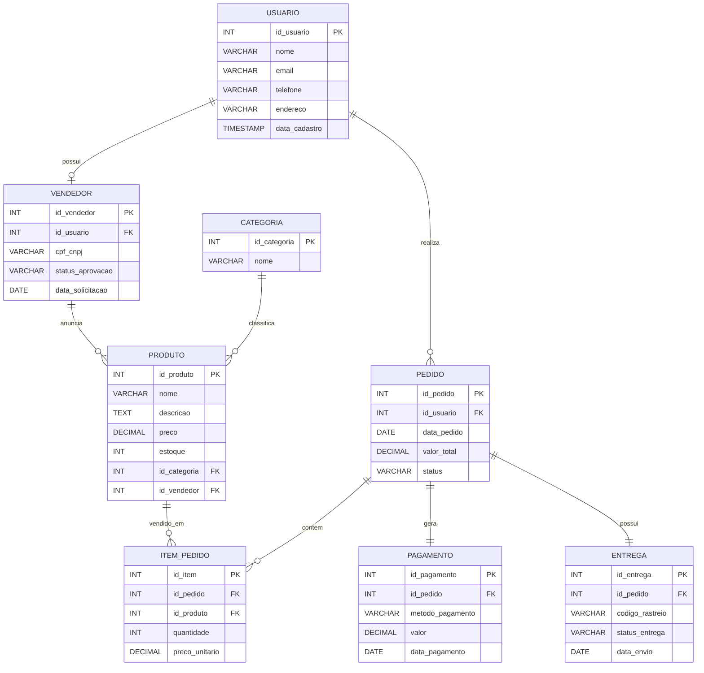

# Traje-a-Rigor

Projeto de banco de dados para uma loja de roupas online que permite que compradores se tornem vendedores após um processo de análise e aprovação.

## Descrição do Projeto

O Traje a Rigor é um marketplace de roupas que conecta compradores e vendedores em uma única plataforma. Os usuários podem criar uma conta para realizar compras e, caso desejem vender produtos, devem solicitar um cadastro de vendedor, que será analisado e aprovado pela administração do sistema.

O banco de dados foi projetado para gerenciar usuários, vendedores, produtos, categorias, pedidos, pagamentos e entregas, garantindo a integridade e consistência das informações armazenadas.

## Objetivo Geral

Desenvolver um banco de dados relacional para um marketplace de roupas online, permitindo o gerenciamento eficiente de clientes, vendedores, produtos, pedidos, pagamentos e entregas.

## Público-Alvo

* Consumidores interessados em comprar roupas online.
* Pessoas que desejam vender roupas por meio da plataforma.
* Administradores responsáveis pela aprovação de vendedores e gestão do marketplace.

## Principais Funcionalidades

* Cadastro de usuários.
* Solicitação de cadastro para vendedor.
* Aprovação e gerenciamento de vendedores.
* Cadastro e gerenciamento de produtos.
* Organização dos produtos por categorias.
* Realização e acompanhamento de pedidos.
* Processamento de pagamentos.
* Controle de entregas e rastreamento.
* Histórico de compras dos usuários.

## Modelo Relacional



## Tecnologias Utilizadas

* PostgreSQL
* SQL (DDL e DML)
* GitHub

## Estrutura do Projeto

```text
traje-a-rigor/
│
├── README.md
│
└── scripts/
    ├── V1__create_table_usuario.sql
    ├── V1__create_table_vendedor.sql
    ├── V1__create_table_categoria.sql
    ├── V1__create_table_produto.sql
    ├── V1__create_table_pedido.sql
    ├── V1__create_table_item_pedido.sql
    ├── V1__create_table_pagamento.sql
    ├── V1__create_table_entrega.sql
    ├── V2__insert_dados_iniciais.sql
    ├── V3__update_dados.sql
    ├── V4__delete_dados.sql
    ├── V5__create_view_produtos_vendedores.sql
    └── V6__create_or_replace_function_total_pedidos.sql
```
